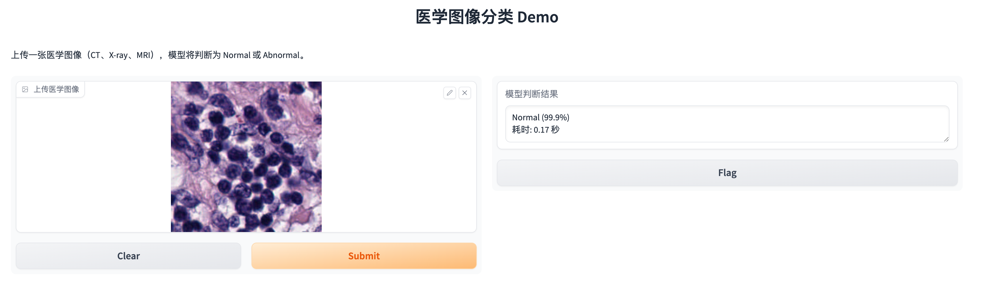

# Gradio4Visual

> 🧪 **本项目为个人学习用途，旨在练习使用 Gradio 构建医学图像可视化推理界面**  
> 👩‍⚕️ 上传一张医学图像（如 CT、X-ray 或 MRI），模型将判断其是否为 **Normal** 或 **Abnormal**，并显示置信度。

---

## 🚀 项目特色

- 📤 支持上传医学图像进行实时预测  
- 🧠 使用简洁的 PyTorch CNN 模型进行二分类  
- 🎨 Gradio 提供前端可视化界面  
- 📊 输出分类标签及预测置信度  
- 🛠️ 适合用于快速测试、调试和教学演示  

---

## 🖥️ 本地运行方式

```bash
# 克隆仓库
git clone https://github.com/yourname/Gradio4Visual.git
cd Gradio4Visual

# 可选：创建虚拟环境（推荐）
conda create -n med_demo python=3.9 -y
conda activate med_demo

# 安装依赖
pip install -r requirements.txt

# 启动 Demo
python demo.py

```

初次运行请确保当前目录下存在训练好的模型权重文件 med_model.pth。


---

## 🧠 模型简介

- **框架**：PyTorch  
- **模型**：SimpleMedNet（轻量级卷积神经网络）  
- **分类任务**：二分类（Normal vs Abnormal）  
- **输入尺寸**：224 × 224  
- **界面平台**：Gradio

---

## 🧪 界面展示

<div align="center">
  
</div>

---

## 📌 学习计划

- [ ] 添加 Hugging Face Spaces 在线部署支持  
- [ ] 支持 GPU 推理  
- [ ] 扩展为多类别医学图像分类  
- [ ] 增加图像预处理可视化模块  

---

## 📄 License

MIT License © 2025 [Ye Zhang]

